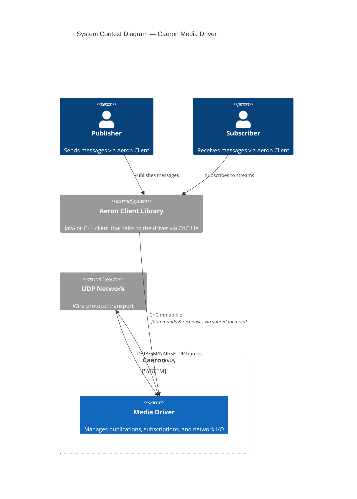
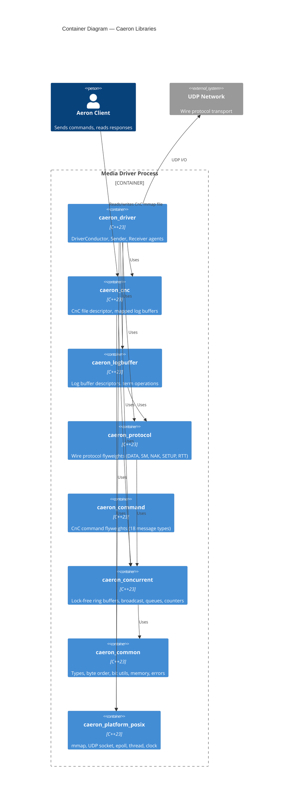
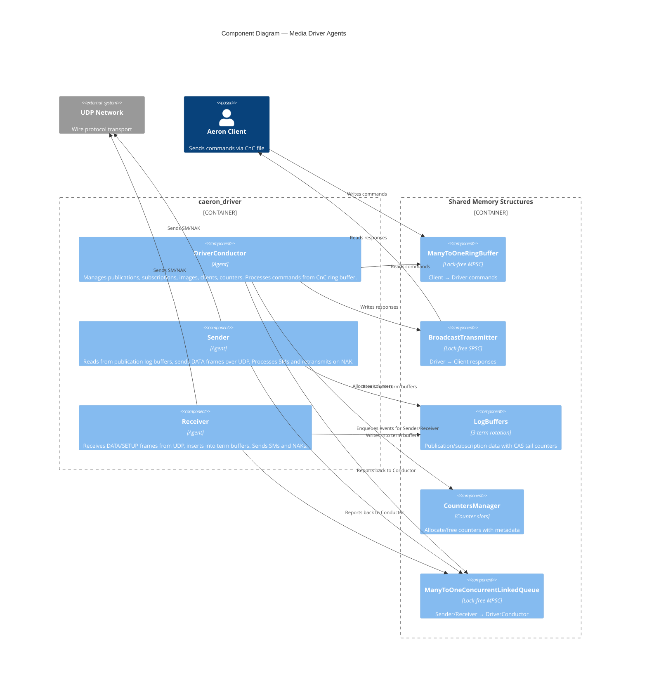

# Caeron Architecture

Caeron is a C++23 port of the [Aeron](https://github.com/real-logic/aeron) Media Driver. This document describes the scaffold structure and design decisions.

## C4 Architecture

### Level 1: System Context

The Caeron Media Driver sits between Aeron clients and the network. Clients communicate with the driver through a shared memory-mapped CnC file; the driver sends and receives media frames over UDP.



### Level 2: Container

The driver is composed of several static libraries grouped by concern. Shared libraries sit at the bottom and are reusable by future Aeron Cluster and Aeron Archive components.



### Level 3: Component — Driver Internals

The driver runs three agent threads, each on its own dedicated thread. They communicate through lock-free shared data structures — no mutexes.



## Project Layout

```
Caeron/
├── CMakeLists.txt              # Root build (C++23, GoogleTest via FetchContent)
├── cmake/
│   └── CompilerWarnings.cmake  # Strict warnings (-Wall -Wextra -Werror)
├── src/
│   ├── caeron/                 # Core libraries
│   │   ├── common/             # Fundamental types and utilities
│   │   ├── concurrent/         # Lock-free data structures
│   │   ├── protocol/           # Wire protocol flyweights
│   │   ├── command/            # CnC command flyweights
│   │   ├── logbuffer/          # Log buffer descriptors and operations
│   │   ├── cnc/                # Command-and-Control file
│   │   ├── driver/             # Media Driver agents (future)
│   │   ├── cluster/            # Aeron Cluster (placeholder)
│   │   └── archive/            # Aeron Archive (placeholder)
│   └── platform/
│       └── posix/              # POSIX platform abstraction
├── tests/
│   ├── common/
│   ├── protocol/
│   ├── command/
│   ├── concurrent/
│   ├── logbuffer/
│   ├── cnc/
│   ├── driver/
│   └── platform/
└── docs/
```

## Library Dependency Graph

```
caeron_common (INTERFACE)
    └─► caeron_concurrent
            ├─► caeron_protocol
            ├─► caeron_command
            ├─► caeron_logbuffer
            └─► caeron_cnc ──► caeron_platform_posix
                    └─► caeron_driver (future)
```

All libraries are static. `caeron_common` is INTERFACE (header-only). Future `cluster` and `archive` components will depend on the same shared base.

## Design Principles

### 1. Shared Base, Component-Specific Top

The libraries under `src/caeron/` are split into two tiers:

- **Shared** (`common`, `concurrent`, `protocol`, `command`, `logbuffer`, `cnc`): Used by the driver today, but designed to be reused by future `aeron-cluster` and `aeron-archive` ports. No driver-specific logic lives here.
- **Component-specific** (`driver/`, `cluster/`, `archive/`): Each component gets its own subdirectory. The driver is implemented first; cluster and archive are empty placeholders.

### 2. Flyweight Pattern

Protocol and command messages use the **flyweight** pattern: a lightweight struct that interprets a region of an `UnsafeBuffer` at a given offset. Flyweights are composed (not inherited) — each contains a reference to the buffer and an offset.

```cpp
struct DataHeaderFlyweight {
    UnsafeBuffer& buffer_;
    i32 offset_;

    i32 term_offset() const { return buffer_.get_i32(offset_ + TERM_OFFSET_FIELD_OFFSET); }
    DataHeaderFlyweight& set_term_offset(i32 value) { buffer_.put_i32(offset_ + TERM_OFFSET_FIELD_OFFSET, value); return *this; }
};
```

All multi-byte accessors use `memcpy` internally (via `UnsafeBuffer`) to avoid alignment faults. Byte order is little-endian on x86_64 (static_assert enforced).

### 3. Lock-Free Concurrent Structures

The driver's three agent threads (DriverConductor, Sender, Receiver) communicate through shared memory with no mutexes:

| Structure | Direction | Use Case |
|-----------|-----------|----------|
| `ManyToOneRingBuffer` | Client → Driver | Commands from clients |
| `BroadcastTransmitter` | Driver → Client | Responses/events to clients |
| `BroadcastReceiver` | Client ← Driver | Reading responses |
| `ManyToOneConcurrentLinkedQueue` | Driver internal | Inter-agent messaging |
| `OneToOneConcurrentArrayQueue` | Driver internal | Single-producer queues |
| `CountersManager` | Shared | Counter allocation/deallocation |
| `AtomicCounter` | Shared | Atomic operations on a single counter |

### 4. Memory-Mapped Files

The driver communicates with clients through memory-mapped files:

- **CnC file**: Command-and-Control. Contains the command ring buffer, broadcast buffer, and metadata (version, PID, timestamps).
- **Log files**: Each publication/subscription gets a log file with 3 term buffers + metadata. Terms rotate via CAS on tail counters.

`platform::MemoryMappedFile` provides RAII mmap/munmap.

### 5. Platform Abstraction

Platform-specific code lives under `src/platform/posix/`:

| File | Purpose |
|------|---------|
| `mmap.h/.cpp` | RAII memory-mapped files |
| `udp_socket.h/.cpp` | UDP socket wrapper |
| `epoll_poller.h/.cpp` | I/O multiplexing |
| `thread.h/.cpp` | Thread with CPU affinity |
| `clock.h/.cpp` | Monotonic/realtime clocks |

## Key Data Structures

### Log Buffer Layout

Each log file has this layout:

```
┌─────────────────────────────────────────────┐
│  Term Buffer 0  (default 64MB)              │
├─────────────────────────────────────────────┤
│  Term Buffer 1                              │
├─────────────────────────────────────────────┤
│  Term Buffer 2                              │
├─────────────────────────────────────────────┤
│  Log Meta Data (4096 bytes)                 │
│    - tail counters (3 × i64)                │
│    - active term count                      │
│    - MTU length, session/stream IDs         │
│    - end-of-stream position                 │
└─────────────────────────────────────────────┘
```

Terms rotate: term N maps to `buffer[N % 3]`. Tail counters are packed as `(term_id << 32 | term_offset)` and updated via CAS.

### CnC File Layout

```
┌─────────────────────────────────────────────┐
│  Meta Data (128 bytes)                      │
│    - version, PID, start timestamp          │
│    - to-driver buffer length                │
│    - to-clients buffer length               │
│    - counter metadata buffer length         │
│    - counter values buffer length           │
├─────────────────────────────────────────────┤
│  To-Driver Buffer (commands from clients)   │
├─────────────────────────────────────────────┤
│  To-Clients Buffer (responses to clients)   │
├─────────────────────────────────────────────┤
│  Counter Metadata Buffer                    │
├─────────────────────────────────────────────┤
│  Counter Values Buffer                      │
└─────────────────────────────────────────────┘
```

## Wire Protocol

All frames start with an 8-byte `HeaderFlyweight`:

```
 0                   1                   2                   3
 0 1 2 3 4 5 6 7 8 9 0 1 2 3 4 5 6 7 8 9 0 1 2 3 4 5 6 7 8 9 0 1
+-+-+-+-+-+-+-+-+-+-+-+-+-+-+-+-+-+-+-+-+-+-+-+-+-+-+-+-+-+-+-+-+
|                        Frame Length                           |
+-+-+-+-+-+-+-+-+-+-+-+-+-+-+-+-+-+-+-+-+-+-+-+-+-+-+-+-+-+-+-+-+
|    Version    |     Flags     |            Type               |
+-+-+-+-+-+-+-+-+-+-+-+-+-+-+-+-+-+-+-+-+-+-+-+-+-+-+-+-+-+-+-+-+
```

Frame types: DATA(0x01), SETUP(0x04), NAK(0x02), SM(0x03), RTT(0x05), ERROR(0x06), etc.

## Build System

- **CMake 3.28+** with C++23
- **GoogleTest** fetched via FetchContent
- **Compile flags**: `-Wall -Wextra -Wpedantic -Werror -Wconversion -Wsign-conversion`
- Each library has its own `CMakeLists.txt` under `src/caeron/` and `src/platform/`
- Tests mirror the source structure under `tests/`

## Testing Strategy

- Unit tests for each library component
- Flyweight tests verify field offsets match Java Aeron's binary layout
- Concurrent structure tests verify lock-free correctness
- Platform tests verify POSIX wrapper behavior
